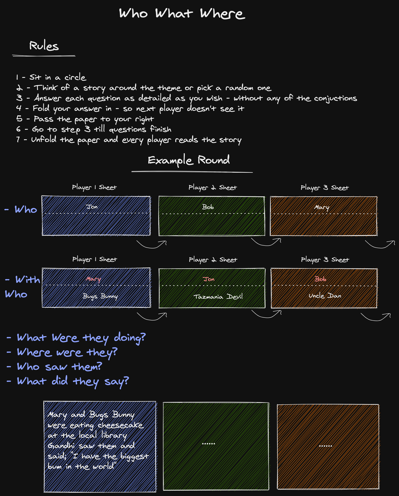

# Introduction

Hi all,

Looking to design and develop this fun paper game from my childhood in digital with elixir, phoenix (channels, presence), and possibly LiveView with the members of this community.

*I already have a working one with angular+socketio+python so this is a good learning curve with the elixir community.*

Here is the game, rules, and a sample round of me trying to explain how the game works. This game might exist online already under different names for different cultures. I didn't investigate.

# Rules and Play


# Design

I aim to follow the design principles that are demonstrated and explained brilliantly in this article as much as possible 

https://www.theerlangelist.com/article/spawn_or_not

## Aspirations (intentionally left vague)
- Hoping for `store nothing` approach
- If `things` need to be stored somewhere, prefer `eviction and memory` based storage.
- `things` should keep a tidy house at all times within their scope.

## Behaviours

### Player
```
Scenario: New user identification success
Given I am an anonymous user
  and I visit the Game Server 
  and I am required to enter my name
When I enter "nickname"
Then the "nickname" is accepted

Scenario: New user identification, nickname non UTF-8 encoding
Given I am an anonymous user
  and I visit the Game Server 
  and I am required to enter my name
When I enter "0xC0, 0xC1, 0xF5, 0xF6, 0xF7, 0xF8, 0xF9, 0xFA, 0xFB, 0xFC, 0xFD, 0xFE, 0xFF"
Then the "0xC0, 0xC1, 0xF5, 0xF6, 0xF7, 0xF8, 0xF9, 0xFA, 0xFB, 0xFC, 0xFD, 0xFE, 0xFF" is rejected

Scenario: New user identification, nickname too long
Given I am an anonymous user
  and I visit the Game Server 
  and I am required to enter my name
When I enter "nickname longer than 20 characters"
Then the "nickname longer than 20 characters" is rejected
```
I will slowly expand the following `Rooms, Gathering Hall, and Server` as scenarios in time.

### Rooms
- Can be created
- Should have an identifier
- Should have a string identifying the name 
- Should have a string language identifying the language used in the room.
- Should have a flag of being `private` or `public`
- Minimum 3 players needed to start a `round` and play the game.
- Able to know which players are in the room
- There is no maximum player limit to a room but should investigate for performance reasons.
- Can be joined only, if it hasn't reached `maximum user count and no active round is in play`
- Can initiate a new round by the 'administrator' if there are more than `2 players` in the room.
- Can be destroyed by the `creator` or `administrator`
- Can be destroyed only `if there is no active round`
- Players should be able to `chat` with each other outside of an `active round`
- Should do `self-cleaning` where possible
### Round
- Can be initiated by 'administrator
- All the players should receive the first question at the `roughly` same time
- After answering a question, `player` should be presented with the next one.
- If a player finishes all their questions, they simply wait for `all players` to finish.
- If the player count has fallen below the `minimum` players at any instance, the round should be abandoned
- Should be able to identify which players have answered the `current/past` questions
- Should have a `maximum time set` to end the round if it does not end by player interaction.
- Round finishes when `all the questions are answered by` all the players`
- Round should be able to display the `stories` on each player's screen upon finishing.
- Chat should be activated when a round has `finishes` regardless of reason
- Should do `self-cleaning` where possible
### Gathering Hall
- Should list all the `public` rooms that are `available to join`
- Should include `name, language, player count` of each room
- Should be able to filter by `language`
- Should be able to `sort` by `player count`
- Should do `self-cleaning` where possible

# Community

I want this to be a community effort where people can peer-review each other's code and approach and we can all learn from each other in a fun small project.

## Repositories

Elixir Library - https://github.com/ykurtbas/elixir-www

Phoenix UI - https://github.com/ykurtbas/phoenix-www

### More Questions?
I didn't take any further design restrictions and decisions.

I probably missed a couple of important points, either on purpose - not to dictate the design or genuinely forgot. Please ask away!

Please let me know what you think or ideas for implementation, developing together.